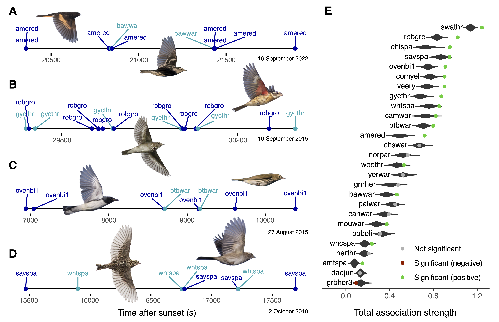

```{r}
#| label: include-supplement
#| cache: false

am_compiling_word <- TRUE
```

```{r}
#| label: load-packages
#| cache: false

library(dplyr)
library(stringr)
library(ggplot2)
library(patchwork)
library(igraph)
```

```{r}
#| label: load-analysis
#| cache: false
#| cache.lazy: false

load('data/subset.RData')

```

\newpage

# Summary

An emerging frontier in ecology explores how organisms integrate social
information into movement behavior and the extent to which information
exchange occurs across species boundaries [@flack2022; @aikens2022;
@oestreich2022]. Most migratory landbirds are thought to undertake
nocturnal migratory flights independently, guided by endogenous programs
and individual experience. Little research has addressed
the potential for social information exchange aloft during nocturnal
migration, but social influences that aid navigation, orientation, or
survival could be valuable during high-risk migration periods
[@flack2022; @aikens2022; @loonstra2023; @byholm2022;
@dhanjal-adams2018]. We captured audio of \>18,000 h of nocturnal bird
migration and used deep learning to extract \>175,000 in-flight
vocalizations of 27 species of North American landbirds [@hamilton1962;
@evans2002flight; @farnsworth2005; @vandoren2024]. We used vocalizations
to test whether migrating birds distribute non-randomly relative to
other species in flight, accounting for migration phenology, geography,
and other non-social factors. We found that migrants engaged in distinct
associations with an average of 2.7 ± 1.9 SD other species. Social
associations were stronger among species with similar wing morphologies
and vocalizations. These results suggest that vocal signals maintain
in-flight associations that are structured by flight speed and behavior
[@gayk2021; @gayk2023; @farnsworth2005]. For small-bodied and
short-lived bird species, transient social associations could play an
important role in migratory decision-making by supplementing endogenous
or experiential information sources [@németh2007; @larkin2008;
@cohen2020]. This research provides the first quantitative evidence of
interspecific social associations during nocturnal bird migration,
supporting recent calls to rethink songbird migration with a social lens
[@aikens2022]. Substantial recent declines in bird populations
[@rosenberg2019; @bairlein2016] may diminish the frequency and strength
of social associations during migration, with currently unknown
consequences for populations.

# Results

<!-- # Introduction -->

The migratory journeys of diverse taxa frequently overlap in space and
time [@cohen2020]. Bird migration is a prime example, with hundreds of
millions of individuals of dozens of species often in the air on a given
night [@cohen2020; @vandoren2018]. Though existing research on
navigation and decision-making during songbird migration has often
emphasized the role of endogenous timing and navigation programs,
opportunities for social information exchange occur frequently during
stopover [@németh2014; @németh2007; @rodewald2002; @desimone2024] and
migratory flight, when many taxa actively vocalize [@farnsworth2005;
@evans2002flight; @morris2016]. In-flight vocalizations may be important
for communicating social information en route [@gayk2021; @gayk2023;
@farnsworth2005; @griffiths2016; @ress2024; @winger2019], and social
information could aid in navigational decision-making, finding
appropriate stopover habitat, or identifying other individuals with
which to form mixed-species foraging flocks during stopover. In other
contexts, social information use among heterospecifics has been
demonstrated empirically (e.g., nest site choice [@seppänen2007];
terrestrial migration stopover [@németh2007]; foraging [@hillemann2020;
@firth2016]). However, it is unknown what information might be exchanged
or used during nocturnal migratory flights [@cohen2020].

Here, we investigate whether nocturnally migrating bird species form
consistent social associations during migratory flights. We use
recordings of in-flight vocalizations to characterize patterns of
species’ spatial and temporal proximity and test whether species’
distributions aloft differ from a null expectation based on non-social
factors including shared phenology and geography. Significant
differences from the null hypothesis would suggest an active behavior
driving social association among species. We investigate the factors
that explain any species associations, hypothesizing that species with
similar migration routes, stopover habitats, morphologies,
vocalizations, and evolutionary histories will be more likely to
socially associate. Finally, we consider how social information exchange
could be an important contributor to the movement ecology of nocturnally
migrating birds.

## Songbirds associate with other species during migratory flights

We collected acoustic recordings of
`r format(sum(file_df$duration_s)/3600,scientific=F)` hours of autumn
nocturnal bird migration (August to December) from `r n_sites_all` sites
in eastern North America. We extracted vocalizations of migrating birds
(hereafter "flight calls" [@evans2000acoustic; @farnsworth2005]) from
audio data using a deep learning model that we designed for this purpose
[@vandoren2024], and we manually reviewed species detections for
accuracy to ensure data quality. We focused on
`r length(unique(data_df$predicted_category))` well-sampled species: 25
songbird species (Order Passeriformes), plus two heron species (Order
Pelecaniformes), which we included to examine the potential for
associations between songbirds and other orders. We constructed a
network that captures the degree to which detections of different
species occurred synchronously in the data stream conditional on species
co-occurrence (hereafter "social association network"). Using custom
network permutation tests, we evaluated whether the observed social
association network differed from a null expectation that incorporated
shared timing, geography, and other non-social factors that may
contribute to network structure. The observed social association network
was significantly non-random (network coefficient of variation $P_{30s}$
= `r format(coefv.sync.30$pval,digits=3)`). We quantified the overall
tendency of each species to associate with other species during
migratory flights, finding that
`r sum(deg_weighted.sync.30$p$attract<=0.05)` out of
`r length(deg_weighted.sync.30$p$attract)` species in the social
association network showed significantly elevated total association
strengths after accounting for non-social factors
(@fig-detection-example-with-centrality). For this study, we considered
detections to occur synchronously if they occurred in the same 30-s time
window, but we also tested networks constructed using 15-s and 60-s time
windows and confirmed that the results were robust to the choice of
window size (15-s social association:
`r sum(deg_weighted.15$p$attract<=0.05)` of
`r length(deg_weighted.15$p$attract)` significant; 60-s social
association: `r sum(deg_weighted.60$p$attract<=0.05)` of
`r length(deg_weighted.60$p$attract)` significant).

We assessed the statistical significance of social association for every
species pair in the network using custom permutation tests that
accounted for non-social factors that may contribute to network
structure. Of `r n_dyads_30` species pairs with \>100 association
opportunities assessed using 30-s time windows, `r n_sig_dyads_30` were
statistically significant (@fig-sync-dyads-30). This result was
consistent when using other window sizes (15-s:
`r n_sig_dyads_15`/`r n_dyads_15` pairs significant;
<!-- @tbl-top-dyads-15;  --> 60-s: `r n_sig_dyads_60`/`r n_dyads_60`
pairs significant). <!-- @tbl-top-dyads-60). --> For 30-s windows,
species had a mean of
`r format(mean(dyad_edges_summary_df$n_edges_sig),digits=2)` ±
`r format(sd(dyad_edges_summary_df$n_edges_sig),digits=2)` SD
significant association partners, and
`r sum(sig_dyads_30_df$same_family)` of `r nrow(sig_dyads_30_df)`
significant associations were between two species of the same family
(most commonly within the
`r names(which.max(diag(summarize_dyad_fam(sig_dyads_30_df))))`).
Although significant interfamilial associations were less frequent,
those that did occur were of similar strength to intrafamilial
associations (*t*-test: t =
`r format(same_family_sync_strength_t_test.30$statistic,digit=2)`, df =
`r format(same_family_sync_strength_t_test.30$parameter,digit=3)`, P =
`r format(same_family_sync_strength_t_test.30$p.value,digit=2)`).

## Wing morphology and vocalization similarity explain social associations among species

We tested whether in-flight associations among species could be
explained by phylogeny, spatiotemporal distribution, habitat
preferences, social relationships during stopover, morphology, or
vocalizations. We used non-parametric Mantel tests and again evaluated
statistical significance using custom network permutations that
accounted for non-social factors. The similarity of species' wing
lengths and their vocalizations were statistically significant
predictors of social association (@fig-reg-scatter1;
@tbl-regression-30). These relationships were robust to choice of window
size and present using parametric and nonparametric matrix correlations.
These relationships were also present when excluding two large-bodied
heron species and including only species in the order Passeriformes.
Species relationships at stopover, phylogenetic relatedness,
spatiotemporal overlap in species' migration routes, non-breeding range
overlap, and migration-period habitat relationships were not
consistently associated with social association (@tbl-regression-30),
although stopover affiliation index, migration overlap, and non-breeding
range overlap showed some support at other window sizes.

# Discussion

Little is presently known about how organisms integrate interspecific
information into behavioral decision-making, a topic at the cutting edge
of ecology [@aikens2022; @flack2022; @cohen2020; @piersma2022].
Songbirds migrate primarily at night and are typically thought to do so
independently, without information contributions from other birds
[@åkesson2020]. However, our results demonstrate that songbirds engage
in interspecific social associations during nocturnal migratory flights.
The majority of bird species studied showed significantly higher
association strengths than expected under null models accounting for
species co-occurrence and non-social factors, indicating that it is more
likely for these species to occur with heterospecifics than expected by
chance. Social associations were most frequent among species of the same
family, particularly wood-warblers in the family Parulidae, but
significant interfamilial associations were also frequent and no less
strong when present. In contrast, we did not find strong evidence of
social associations across orders (e.g., between Passeriformes and
Pelecaniformes).

Stronger social associations tended to occur between bird species with
more similar wing lengths, but not closer phylogenetic relatedness,
suggesting that flight speed may be important in structuring in-flight
associations [@wang2011]. Over the course of hours-long migratory
flights, individuals with similar flight speeds and altitudes may more
easily maintain close proximity and sustain an association, whereas
individuals with different flight behaviors are more likely to grow
gradually apart, making any such associations ephemeral. Associations
were also stronger among species with more similar vocalizations, a
finding consistent with the hypothesis that flight calls are used to
maintain multi-species associations during migratory flights
[@hamilton1962; @gayk2023]. These findings suggest the possibility that
shared migratory behavior may be driving convergent evolution in
acoustic signals across species [@gayk2021].

In contrast, we found no consistent evidence that fine-scale in-flight
associations were linked to habitat preferences, geographic ranges, or
species affiliations during diurnal stopovers. This result is surprising
given evidence for heterospecific attraction in Palearctic birds, where
playback of heterospecific vocalizations can cause migrating birds to
land and initiate stopover [@hera2017]. Our results suggest that the
interspecific relationships among migrants in the Americas re-shuffle as
they alternate between nocturnal aerial and diurnal terrestrial
habitats, with variables related to flight behavior shaping in-flight
relationships and variables related to foraging behavior shaping
stopover relationships [@desimone2024]. Previous work has connected
vocalization similarity to migration range overlap [@gayk2021], but the
lack of an association between geographic range and social association
in our data suggests that spatial overlap may not be the primary driver
of associations aloft. Although we did not detect a strong spatial
signal in our data, we advocate for exploring the how social
associations may vary across space and how an individual's social
behavior is influenced by its spatial-social context [@webber2023].

## The importance of social information during migration

Our study provides important context for a growing body of evidence that
the social information available to an individual may be an important
and underappreciated contributor to migratory behavior [@oestreich2022;
@aikens2022]. The associations and vocalizations we detect during
nocturnal bird migration may provide a conduit for information exchange.
The use of social information during migration is well documented in
some bird species, such as large-bodied cranes (Gruidae) and storks
(Ciconiidae) [@mueller2013; @abrahms2021; @aikens2024], as well as other
species that commonly form groups or flocks, such as terns (Laridae) and
shorebirds (Charadriiformes) [@byholm2022; @loonstra2023]. In these
species, conspecific social information is thought to be of particular
importance for younger birds undertaking their first migrations.

Our results provide evidence that social information could also be
transmitted during migration among small-bodied and short-lived bird
species that are generally thought to undertake nocturnal migration
independently [@åkesson2020]. Since these species do not learn their
migration routes from their parents, social information could play an
important role in supplementing information from the innate migratory
program, especially for inexperienced birds. Such information could aid
navigation, as has been demonstrated in large-boded diurnal migrants, or
be associated with habitat selection, stopover, or other factors. Flight
calls may encode information about an individual, such as age and sex,
as well as individual identity, which may allow birds to infer the
flight direction of other individuals and facilitate the maintenance of
group cohesion among both conspecifics and heterospecifics
[@griffiths2016; @hamilton1962; @ress2024; @larkin2008].

Social behavior and information use exchange could take several forms,
and our results provide a foundation for testing hypotheses about social
influences on migratory behavior. We highlight several questions for
future research, adapting those identified by [@aikens2022]: (1) What
information might flight calls encode, and what can listening
individuals learn from these signals? (2) Do individuals respond
differently to flight calls over their lifetimes, as the balance shifts
between individual experience and social information? (3) How do
different migration characteristics, such as distance or complexity,
affect how migrants use vocal information? (4) Do species that vocalize
during migration show different patterns of migratory evolution? (5) How
can vocalization data directly inform conservation and management, for
example to lessen the risk of fatal building collisions [@winger2019]?

## Acoustics as a movement ecology tool

Bioacoustics is increasingly important for studying movement ecology. A
study of this scope was made possible only through recent advances in
machine learning that automate an otherwise laborious detection and
identification process. Further work with acoustics promises to reveal
more about associations among and within species, as well as the
decision-making and conservation status of migratory birds. Our
inferences drawn from acoustic monitoring will likely be influenced by
factors that impact the vocalization rate of species and individuals,
such as environmental conditions, social context, and individual traits
[@farnsworth2005]. Currently, it is not possible to distinguish
individuals by call with a standard recording setup, which prevented us
from investigating associations among conspecifics. However, recent
evidence indicates that flight calls may encode individual identity
information in at least some species [@ress2024; @griffiths2016], which
suggests that this may be possible as acoustic analysis methods improve.
Distinguishing individuals is currently only possible using microphone
arrays that allow calling birds’ locations to be triangulated, but this
technique requires significant logistical challenges to implement at
scale [@gayk2020]. Given our results, we would hypothesize that
intraspecific social associations also occur during nocturnal migratory
flights [@gayk2023]. Finally, it is important to recognize that not all
migratory species vocalize during migration [@evans2002flight;
@farnsworth2005]. Future work that integrates acoustic data with thermal
imagery or small-scale radar data could provide a more holistic
understanding of in-flight behavior during nocturnal migration.

## Implications

The vocalizations given by birds during migratory flights provide a
valuable resource for monitoring the movements and populations of
migratory birds, studying their ecologies [@farnsworth2005], and even
understanding anthropogenic hazards like light pollution [@winger2019].
Here, we demonstrate that flight calls provide a window onto a hidden
network of interspecific associations. This study highlights the need
for further investigation into the social context of animal migration.
Recent work supports the important role of transient interspecific
relationships during stopover [@desimone2024], and we propose that
social relationships are also important during migratory flights. Given
substantial declines in migratory bird populations [@rosenberg2019], it
is likely that social associations during migration are diminishing,
with unknown consequences. Any such density-dependent effects may be
complex; a lack of social information might, for example, impede
navigational decision-making, impact the duration and energy expenditure
of migration, and increase mortality risk [@cohen2020; @aikens2022]. An
understanding of these dynamics is essential to assessing and mitigating
negative impacts on populations.

# Resource availability

## Lead contact

Requests for further information and resources should be directed to and
will be fulfilled by the lead contact, Benjamin Van Doren
(vandoren\@illinois.edu).

## Materials availability

This study did not generate new unique reagents.

## Data and code availability

-   Data have been deposited at Mendeley Data and are publicly available
    at DOI 10.17632/dxx5khdzjs.1 as of the date of publication.
-   All original code has been deposited at Mendeley Data and is
    publicly available at DOI 10.17632/dxx5khdzjs.1 as of the date of
    publication.
-   Any additional information required to reanalyze the data reported
    in this paper is available from the lead contact upon request.

# Acknowledgements

Special thanks to Grant Van Horn, Dai Shizuka, Damien Farine, Michael
Lanzone, Michael O'Brien, and three anonymous reviewers. We are grateful
to many individuals and organizations for supporting acoustic data
collection in the Appalachian Mountains region, including: Allegheny
Front Hawk Watch; Grandfather Mountain; Great Smoky Mountains National
Park; Mill Cove Environmental Area; Mountain Lake Biological Station;
Maryland Department of Natural Resources; Nature Conservancy chapters of
North Carolina, Virginia, and West Virginia; Rockfish Gap Hawk Watch;
John Caveny, Christopher Dick, Dan Feller, Laurie Goodrich, Jaime Jones,
J. Drew Lanham, Victor Laubach, Frederick LaVancher, Eric Nagy, Claire
Nemes, Brian Parr, Mike Powell, Jim Ratchford, Robert Stewart, Kate
Stone, and Paul Super. This work was supported by an Amazon Cloud
Credits for Research grant to BMVD, the Cornell Lab of Ornithology, the
Cornell Presidential Postdoctoral Fellowship (to BMVD), and NSF Award
2146052 (to EC and JD). JAF acknowledges funding from NERC
(NE/V013483/1) and WildAI (C-2023-00057). FH was previously affiliated
with the Netherlands Institute of Ecology (NIOO-KNAW) and Max Planck
Institute for Evolutionary Anthropology.

# Author contributions

BMVD conceived of the study, collected data, performed analysis, and
wrote the initial manuscript draft. JAF, FH, and JD shaped the data
analysis. All authors contributed to the final written draft of the
manuscript.

# Declaration of interests

The authors declare no competing interests.

# Supplemental information

Document S1. Tables S1-S4 and Figures S1-S4.

# Figures

```{r}
#| label: fig-detection-example-with-centrality
#| fig-cap: "**Example time series of detections during nocturnal migration and tests of social association strength.**\n Photos from the Macaulay Library at the Cornell Lab of Ornithology. (a) American Redstart (amered; ML112702211) and Black-and white Warbler (bawwar; ML68301071). (b) Gray-cheeked Thrush (gycthr; ML263074761) and Rose-breasted Grosbeak (robgro; ML356438721). (c) Black-throated Blue Warbler (btbwar; ML260441631) and Ovenbird (ovenbi1; ML68440361). (d) Savannah Sparrow (savspa; ML500164831) and White-throated Sparrow (whtspa; ML194675571). (e) Tests of total association strength (weighted degree centrality) for social association network (30-s windows). Violin plots show null distribution and points show observed node strength; statistical significance indicates that a species has a stronger or weaker observed node strength than expected under the null hypothesis. Green points indicate that the observed node strength is significantly greater than expected and that heterospecific attraction can be inferred."
#| fig-align: center
#| out-width: 100%
#| fig-pos: "H"



```

```{r dyads-plot-helper, message=FALSE, echo=FALSE}


colrs <- c("#ffa600", 
           "#ff6e54",
           # "#E785A7",
           "violet",
           "lightblue",
           "lightgreen",
           "gray80")
trait_vec <- otl_df$Family2[match(attr(V(net),"names"),otl_df$species_code)]
trait_vec <- as.factor(trait_vec)


## Graph 3 - social association

net_mat <- net_sync_mask.30
# only plot significant p-values

# adjust the p-values
net_mat[net_sync_nseg.30<100 | dyad_pval.30.adj>0.05] <- 0

net_mat[is.nan(net_mat)] <- 0

pdf(file = NULL)
cp <- corrplot::corrplot(net_mat,
                   is.corr=F,
                   diag=F,
                   method="shade",
                   order = "hclust",
                   hclust.method = "ward.D",
                   tl.col="black",
                   tl.cex=0.8,add=F)
dev.off()

corrplot_taxon_order <- dimnames(cp$corr)[[1]]

```

```{r}
#| label: fig-sync-dyads-30
#| fig-cap: "**Significant social associations.**\n Network diagram and heatmap show only statistically significant edges (30-s time windows). Heatmap values show association strength for each species pair. See Figure S2 and Table S1."
#| fig-height: 5
#| fig-width: 8
#| fig-align: center
#| out-width: 100%
#| fig-pos: "H"

op <- par(mfrow=c(1,2),mar=c(0,0,0,0))

diag(net_mat)<-0 # manually create zero diagonal because the diag=F argument below no longer seems to work properly
net <- graph.adjacency(net_mat, 
                       mode="undirected", weighted=TRUE, diag=F)
# V(net)$color <- colrs[trait_vec]
# V(net)$color <- "white"

set.seed(123)
plot(
  net,
  vertex.frame.color=colrs[trait_vec],
  vertex.frame.width=2,
  vertex.label.color="black",
  vertex.label.cex=.7,
  vertex.label.family="Helvetica",
  vertex.color=ggplot2::fill_alpha(colrs[trait_vec],0.5),
  vertex.size=25,
  edge.width=(edge_attr(net)$weight)*30)


legend("bottomleft",levels(trait_vec), pch=21,
       text.col="black",
       col=colrs, 
       pt.bg=ggplot2::fill_alpha(colrs,0.5),
       pt.cex=2, cex=.8, bty="n", ncol=1)


net_mat[net_mat==0] <- NA
corrplot::corrplot(net_mat[corrplot_taxon_order,corrplot_taxon_order],
                   is.corr=F,
                   diag=F,
                   method="shade",
                   order = "original",
                   hclust.method = "ward.D",
                   tl.col="black",
                   tl.cex=0.8,
                   na.label="square",
                   na.label.col="white",
                   cl.align.text = "l",
                   cl.offset=0.2,
                   cl.cex=0.6,
                   addgrid.col = gray(0.85),
                   col.lim=c(0,max(net_mat,na.rm=T)))


par(op)

```

```{r}
#| label: fig-reg-scatter1
#| fig-cap: "**Scatterplots of statistically significant pairwise species relationships.**\n Each point represents a species pair. Y-axis represents association strength for each species pair, and x-axes show pairwise phenotype distances. Best linear fit drawn to aid interpretation; refer to matrix correlations for coefficient estimates and statistical significance. Plots shown from data generated with 30-s time windows. See Figure S3 and Table S2."
#| fig-align: center
#| fig-width: 5
#| fig-height: 2.5
#| out-width: 20%
#| fig-pos: "H"

p_wl_nostop <- ggplot(scatter_df_nostop,aes(x=dist_wl_log,y=net_sync_mask.30)) +
  geom_point(color=gray(.4),alpha=0.5) +
  # ggrepel::geom_text_repel(aes(label=rowcol)) +
  geom_smooth(method="lm",se=F,color="black") +
  theme_bw() +
  labs(x="Wing length distance",y="Social association")

p_spec_dist_nostop <- ggplot(scatter_df_nostop,aes(x=spec_dist,y=net_sync_mask.30)) +
  geom_point(color=gray(.4),alpha=0.5) +
  # ggrepel::geom_text_repel(aes(label=rowcol)) +
  geom_smooth(method="lm",se=F,color="black") +
  theme_bw() +
  labs(x="Acoustic distance",y="Social association")


p_wl_nostop + p_spec_dist_nostop


```

\newpage

# Tables

```{r}
#| label: tbl-regression-30
#| tbl-cap: "**Nonparametric matrix correlations for the response variable of social association, based on 30-s time windows.**\n Each row corresponds to a single-predictor model. See Table S2."
# 

replace_vec <- c('intercept'='Intercept',
                 'X_stopover_affil'='Stopover affiliation index',
                 'X_phylo_simil'='Phylogenetic similarity',
                   'X_overlap_migration_mean'='Migration overlap',
                 'X_overlap_nonbreeding'='Non-breeding range overlap',
                   # 'X_dist_wl'='Wing length distance',
                 'X_dist_wl_log'='Wing length distance',
                 # 'X_confu'='Acoustic model confusion probability',
                  'X_simil_hab'='Migration habitat similarity',
                 'X_spec_dist'='Acoustic distance'
                  )

the_model <- mantel_single_30

tbl_df <- data.frame(
  Predictor=the_model$predictor,
  `Correlation`=the_model$coefficient,
  `P-value`=the_model$pvalue,
  `No. Taxa`=the_model$n_taxa,
  check.names = F
)

rownames(tbl_df) <- NULL

tbl_df <- tbl_df %>% mutate(Predictor=str_replace_all(Predictor,replace_vec))

the_tbl <- tbl_df %>% 
  knitr::kable(digits=3) #%>% 
  # kableExtra::kable_styling(latex_options=c("HOLD_position")) #%>% 
  # kableExtra::column_spec(2, width = "10em") %>%
  # kableExtra::column_spec(3, width = "10em")
  
if (!am_compiling_word) {
  the_tbl <- the_tbl %>% kableExtra::kable_styling(latex_options=c("HOLD_position")) #%>% 
}

the_tbl
```

# STAR Methods

## Method details

### Acoustic data collection

We collected acoustic recordings of autumn nocturnal bird migration (1
August to 7 December) from `r n_sites_all` sites in eastern North
America, encompassing <INSERT HERE> hours of
monitoring across `r n_nights` nights, with an average of
`r round(mean(nights_per_site$n_nights),1)` ±
`r round(sd(nights_per_site$n_nights),1)` SD nights of monitoring per
recording station. The recording data come from three monitoring
efforts: (Dataset 1) multi-station monitoring in central New York State
during fall 2015 (BirdVox-Full-Season [@farnsworth2022; @vandoren2023a;
@cramer2020]); (Dataset 2) multi-station monitoring in southern New York
State during fall 2010-2011 [@vandoren2015]; and (Dataset 3) a 2000-km
recording transect across the Appalachian mountain region in eastern
North America during fall 2022. Although the hardware differed by
monitoring effort, all units were designed and deployed specifically to
record migrating birds' nocturnal flight calls. The likely maximum
sampling range of the sensors was 300-600 m above ground level,
depending on species call characteristics and ambient conditions
[@stepanian2016; @evans2000acoustic; @evans1999].

### Acoustic data processing

To extract nocturnal flight calls from audio data, we used Nighthawk, a
machine learning tool designed for detecting and classifying nocturnal
flight calls [@vandoren2024]. The Nighthawk core model [@vandoren2024]
is freely available [@vandoren2023], and it has been validated on
diverse test data, including on the BirdVox-Full-Season dataset (Dataset
1, above) [@vandoren2023]. Performance on target datasets can be
improved by conducting additional model training with the dataset in
question, termed "fine-tuning" [@vandoren2024]. We therefore fine-tuned
models on Datasets 2 and 3 to maximize model accuracy on those datasets.
We manually screening a representative sample of audio data for flight
calls and using this dataset to fine-tune Nighthawk [@vandoren2024]. For
Dataset 2, we used existing annotations [@vandoren2015]. For Dataset 3,
which had not been previously analyzed, we randomly sampled
`r nrow(app_durations_df)` segments of audio each 10 minutes in duration
(total `r round(sum(app_durations_df$asset_dur_s)/3600,1)` h;
`r round(sum(app_durations_df$asset_dur_s)/sum(file_df$duration_s[file_df$dataset=="Appalachian"])*100,1)`%
of Dataset 3) and screened these for nocturnal flight calls. We then set
aside one half of screened data for model fine-tuning and the other half
for model validation [@vandoren2024]. That study evaluated multiple
fine-tuning approaches; we used the custom batch construction strategy
described in that paper since it requires only one epoch of additional
training while producing a model that performs very well on target data
and original test data.

After fine-tuning, we ran Nighthawk on all data using the freely
available Python utility [@vandoren2023]. For Dataset 1, we used the
core model provided in the public package. For Datasets 2 and 3, we
substituted in the corresponding fine-tuned model. We used the following
important parameters when running the model:

-   **--no-calibration**: do not apply default calibration parameters.
-   **--threshold 50**: export all detections with a probability score
    of 0.50 or greater.
-   **--ap-mask 0**: do not filter out taxa based on performance on the
    core Nighthawk test dataset.
-   **--tax-output**: export outputs for each taxonomic level
    independently.

We performed data processing on Amazon Web Services to parallelize
inference across thousands of CPU cores. We mapped each detection to
time relative to nautical twilight, when the center of the sun is 12
degrees or more below the horizon. We retained detections occurring
during the nocturnal period after nautical dusk or before nautical dawn,
when any detected flight calls can confidently be attributed to
individuals in active nocturnal migratory flight.

Nighthawk returns classifications at multiple taxonomic levels,
including order, family, and species. Because we were focused on testing
relationships among well-represented species, we only included
detections at the species level for species with \>250 detections across
the dataset. Although our focus is on Passeriformes, we also included
two nocturnal migrant species in the order Pelecaniformes to examine the
potential for associations between passerines and other orders.

Because our analysis relies on high quality detection data, we used a
multi-step review process to ensure detection accuracy. First, we
randomly sampled up to 200 detections per species per dataset and
manually screened these detections for accuracy. We used the results to
set confidence thresholds for each species in each dataset to target a
precision of approximately 0.95 on all classes. After retaining
detections with confidence scores above the corresponding thresholds,
authors BMVD and AF manually reviewed all acoustic detections from the
subset of 30-s time windows that included multiple taxa. In other words,
we manually reviewed all data that contributed to any potential
associations among species pairs. In total, we reviewed
`r nrow(reviewed_detections_df)` detections. We conservatively removed
all detections with any ambiguity in species identity, primarily
recordings with a low signal-to-noise ratio. In total, we removed
`r sum(reviewed_detections_df$exclude)` detections
(`r round(sum(reviewed_detections_df$exclude)/nrow(reviewed_detections_df)*100,1)`%
of those reviewed). After all filtering steps, our acoustic dataset
comprised `r nrow(data_df)` detections of flight calls from
`r length(unique(data_df$predicted_category))` species
(@fig-detection-example-with-centrality).

### Network generation: Fine co-occurrence networks

We used acoustic detections to construct networks of observed species
co-occurrence in the acoustic temporal data stream. In these networks,
stronger connections among species indicate that those species were
recorded together more frequently during migratory flights. To construct
networks, we split our acoustic data streams into independent,
nonoverlapping 30-s windows and grouped species detected in the same
30-s window into "events." Although this choice was somewhat arbitrary,
an interval of 30 s corresponds to a maximum linear distance of 450 m,
assuming a bird's groundspeed of 15 $m s^{-1}$; we reasoned that
migrating birds recorded in the same 30-s window would likely be close
enough to hear one another and potentially exchange information. We
quantified network connections from these 30-s events using the default
Simple Ratio Index formula implemented in the `get_network` function in
the R package `asnipe` [@farine2013]. For a given pair of species, the
Simple Ratio Index is calculated by dividing the number of events (i.e.
30-s windows) in which both species occur by the number of events in
which either one or both species occur. We also constructed networks
using 15-s and 60-s windows to assess whether the results were sensitive
to the choice of window length. Networks generated from different window
sizes were very tightly correlated using Mantel correlations (30-s vs.
60-s: r = `r format(cor.prox.30.60,digit=2)`; 30-s vs. 15-s: r =
`r format(cor.prox.30.15,digit=2)`). We refer to these networks as
**fine co-occurrence** **networks** because they capture the degree to
which vocalizations of each species pair occur close together in our
data stream.

### Network generation: Coarse co-occurrence network

The network connection strength among species in fine co-occurrence
networks is partly a function of species' similarity in migration
timing, geographic distributions, and other factors unrelated to social
associations. We accounted for this by constructing an acoustic network
as described above, but with events defined using longer 15-*minute*
time windows. Rather than considering fine-scale social associations,
this **coarse co-occurrence** **network** captures broader species
co-occurrence in the dataset driven by shared seasonal timing,
geography, and consistent behavioral patterns over the nocturnal period.

### Network generation: Social association networks

Because connections among species in fine co-occurrence networks may
arise from factors that are unrelated to species' propensity to actively
associate, we used the coarse co-occurrence network to control for these
factors. The goal was to generate networks that explicitly captured the
degree to which species' vocalizations occurred synchronously,
independent of shared timing, geography, or other non-social factors. We
calculated **social association networks** as follows: for each species
pair, we subset the data to only the 15-minute time periods in which
both species were detected. Then, we calculated the Simple Ratio Index
on this subset using 30-s windows as described above. To ensure that our
measures were reliable, we did not calculate social association for
species pairs for which there were less than 100 15-minute windows in
which the two species occurred (i.e. \<100 association opportunities).
After performing these calculations for all pairs of species, the
resulting social association network captured the degree to which
vocalizations of each species pair occur close together, *conditioned*
on the time periods during which both species are detected. Because this
metric is conditioned on species co-occurrence, these networks do not
depend on seasonal migration timing or nocturnal vocalization patterns;
they only quantify the degree of acoustic synchronicity among species
pairs independent of broader temporal or geographic patterns. As above,
we also generated social association networks for 15-s and 60-s window
durations to assess whether our results were sensitive to the choice of
window length. Networks generated from different window sizes were very
tightly correlated using Mantel correlations (30-s vs. 60-s: r =
`r format(cor.sync.30.60,digit=2)`; 30-s vs. 15-s: r =
`r format(cor.sync.30.15,digit=2)`).

### Generating network covariates

To test hypotheses about the drivers of species associations during
migration, we generated seven covariates that summarize the similarity
of each species pair in phylogeny, spatiotemporal distribution, habitat
preferences, social relationships during stopover, morphology, and
vocalization structure.

#### Phylogenetic relationships

We obtained a phylogenetic tree of the species included in our study
using the R package `clootl` [@mctavish2024]. We used the `extractTree`
function in that package to output a tree and used the
`cophenetic.phylo` function in the R package `ape` [@paradis2019] to
convert the tree topology to pairwise phylogenetic distances for all
species pairs. We used the inverse of these distance values as measures
of phylogenetic similarity.

#### Species geographic ranges

For each species pair, we calculated pairwise range overlap scores for
their non-breeding ranges. We used species ranges modeled by eBird
Status & Trends [@fink2020] to calculate pairwise overlap for each
species pair. We used the eBird Status & Trends models accessible in the
R package `ebirdst` (v. 2.2021.3) [@strimas-mackey2022]. We downloaded
Status & Trends data for each species and used the `load_ranges`
function to extract the modeled ranges. We then calculated the range
overlap for each species pair by dividing the area of the intersection
of the two ranges by the area of the union of the two ranges.

#### Migration overlap

We estimated the overall migration similarity for each species pair
using a spatiotemporal measure of overlap in the species' geographic
distribution during migration season. We extracted weekly 27x27 km
relative abundance rasters for each species using the `ebirdst` package
and subset these to the migration period for that species as defined by
eBird in the package. For each species pair, we found the total number
of cells where modeled relative abundance was greater than zero for both
species, and we divided this by the total number of raster cells where
relative abundance was greater than zero for either species. This
resulted in a proportion of overlapping cells for each week. Finally, we
took the mean weekly overlap proportion across all weeks of the
migration periods. This resulted in a single proportion value for each
species pair that captured the spatiotemporal overlap in their
geographic distributions during the migration period.

#### Stopover habitat

To calculate the degree of similarity in the habitat preferences of each
species pair during the migration season, we extracted weekly habitat
associations from eBird Status & Trends data [@fink2020]. We filtered
habitat association data to the migration period for each species using
the migration period dates provided in the `ebirdst` package. Using all
available habitat association characters, we used the `dist` function in
R to calculate a pairwise distance matrix that captured the overall
pairwise similarity in habitat associations for all species pairs.

#### Social affiliations during stopover

To assess migratory species’ social networks at stopover sites, we used
over half a million records of banded migratory birds collected during
spring and fall migration seasons by Braddock Bay Bird Observatory
(43.324, -77.717), Long Point Bird Observatory’s banding stations at Old
Cut (42.584, -80.398) and Breakwater (42.561, -80.284), Powdermill Avian
Research Center (40.164, -79.268), and Michigan State Bird Observatory’s
Burke Lake banding station (42.812, -84.383). More details about these
datasets are reported in [@desimone2024].

Following that study [@desimone2024], we calculated species associations
from the banding data using the Simple Ratio Index. Next, we calculated
generalized affiliation indices by regressing the species associations
against measures of temporal overlap, spatial overlap, and relative
abundance. The standardized residuals of the regression are the
generalized affiliation indices for each species pair. The affiliation
indices quantify the degree to which two species associate after
accounting for structural features of the data, including temporal
overlap, spatial overlap, and relative abundance. We calculated fall
affiliation indices separately for each site and averaged affiliation
values across sites. We included only species with \>100 fall captures.

#### Wing-length measurements

Because body morphology impacts flight behavior and could contribute to
in-flight dynamics, we extracted wing-length measurements from the
AVONET dataset [@tobias2022] for each species. Wing length is associated
with flight speed and flight style and may influence species' in-flight
associations. For each species pair, we calculated the Euclidean
distance between the base-10 logarithms of their wing lengths as a
measure of the difference in wing length (hereafter "wing length
distance").

#### Acoustic distance

It is possible that bird species with more acoustically similar flight
calls may be more likely to interact during migration [@gayk2023]. To
evaluate this hypothesis, we calculated the acoustic distance of the
vocalizations given by species in our dataset. We randomly sampled 200
vocalizations for each species from the expert-verified set of
recordings used in @vandoren2024 and selected recordings with
sufficiently clean spectrograms for further analysis. We retained a mean
of `r round(mean(spec_n_per_spp),1)` ± `r round(sd(spec_n_per_spp),1)`
SD (range `r min(spec_n_per_spp)`--`r max(spec_n_per_spp)`)
vocalizations per species. We used Raven Pro 1.6
[@k.lisayangcenterforconservationbioacoustics2024] to manually draw
bounding boxes around each call and used the `spectro_analysis` function
in the R package `warbleR` [@araya-salas2017] to extract a series of
`r ncol(data_for_pca)-1` spectrographic measurements. See `warbleR`
documentation for a description of measurements. We summarized these
measurements using a Principal Component Analysis (`PCA` function in R
package `FactoMineR` [@lê2008]) and extracted the first
`r ncol(pca_spp_df)` components, comprising
`r round(pca_res$eig[5,'cumulative percentage of variance'],1)`% of
total variance. We used the centroids of each species in
multidimensional PCA space to generate a distance matrix (`dist`
function in the base R package `stats` [@rcoreteam2024]) that describes
acoustic distance among species. Smaller values indicate more similar
vocalizations.

## Quantification and statistical analysis

### Generating null network distributions with permutations

To test the statistical significance of network parameters, including
the strength of species connections in co-occurrence and social
association networks, we generated null distributions of network
parameters using custom permutations of the original data stream. The
permutation procedure was as follows: first, we divided acoustic
detection data into 15-minute periods for each site and date. Then, *for
each species* in each 15-minute period, we shifted the timing of all
detections by a random time interval between 0--15 minutes. Each species
present in the 15-minute period was shifted by a different random
interval, and all calls of that species in that period were shifted by
the same amount. If the procedure shifted any detections further than
the bounds of the 15-minute period, those detections were "wrapped
around" to the beginning of the period. In this way, each permuted time
period maintained the same quantity and the same temporal structure of
vocalizations of each species as the original dataset. This procedure
randomly changed the degree to which different species' vocalizations
occurred relative to other species, allowing us to test a null
hypothesis of no association among species in vocalization patterns.
After applying this permutation procedure independently to every
15-minute period in the dataset, we calculated co-occurrence and social
association networks from the permuted data using the procedures
described above. We repeated this procedure 1000 times, yielding 1000
null networks for 15-, 30-, and 60-s window sizes.

### Testing for network randomness

We first evaluated whether networks of co-occurrence and social
association differed significantly from random. We calculated the
network coefficient of variation by taking the standard deviation of the
adjacency matrix and dividing it by the mean of the adjacency matrix. We
performed this calculation for observed networks and for all permuted
networks. If the observed coefficient of variation was greater than the
0.95 quantile of the corresponding null (permutation) distribution, we
considered the network non-random at the P\<0.05 level. Networks
contained n = `r length(unique(data_df$predicted_category))` species.

### Testing for social associations among species

We evaluated the statistical significance of each species' (n =
`r length(unique(data_df$predicted_category))`) connections with other
species in networks using null distributions derived from the permuted
networks. For each species, we quantified its overall tendency to occur
with other species during migratory flights by summing the strength of
all network connections between the focal species and other species,
also known as the weighted degree centrality. Larger degree values
indicate that a species shows stronger and/or more numerous connections
to other species in the network. We compared total association strength
values calculated from observed co-occurrence and social association
networks to those calculated from the corresponding permuted networks.
We considered a species to show statistically significant associations
with other species if the observed total association strength for that
species was greater than the 0.95 quantile of the corresponding null
distribution derived from the permuted networks.

We assessed statistical significance for every species pair in
co-occurrence and social association networks using the same procedure:
we compared the connection strength for a given species pair with the
null distribution of values derived from the corresponding null
networks. We again assessed significance by comparing observed values to
the corresponding null distribution. We corrected p-values for multiple
testing using a false discovery rate correction with a false discovery
rate of 0.05.

### Explaining migrant associations

Finally, we tested whether in-flight associations among species could be
explained by phylogeny, spatiotemporal distribution, habitat
preferences, social relationships during stopover, morphology, or
vocalization structure. We constructed single-predictor statistical
models in which the response variable was social association. As
described above, social association does not depend on seasonal
migration timing or nocturnal vocalization patterns; it quantifies the
degree of social association among species pairs independent of broader
temporal or geographic patterns.

We evaluated statistical significance using a modification of the Mantel
test procedure (`mantel` function in R package `vegan` [@oksanen2024]):
for each predictor, we calculated the Mantel matrix correlation between
that predictor and the social association matrix; then, we compared this
observed statistic to the null distribution of test statistics obtained
from our custom set of permuted social association networks. For each
test, the p-value was the proportion of permuted networks that achieved
a Mantel correlation equal to or more extreme than the observed
statistic. To eliminate any bias from skewed data distributions, where
outliers could exert a strong influence on the correlation value, we
calculated Mantel statistics using the nonparametric Spearman rank
correlation. For comparison, we also obtained results using the standard
Pearson correlation. For the single-predictor case, the Pearson-based
tests of statistical significance were equivalent to those obtained
using Multiple Regression Quadratic Assignment Procedure (MRQAP) to
regress predictor matrices on the response matrix, as recommended for
networks [@farine2017], using the `mrqap.custom.null` function in the R
package `asnipe` [@farine2013]. The number of taxa in each model ranged
between 22--27 and is reported for each model in <INSERT REF TO TABLE>.

We elected to use a series of single-predictor models instead of
multiple matrix regression for the following reasons: first, we did not
have stopover affiliation data for all species, and this imbalance would
have required removing those species from a multiple regression model
and/or running multiple sets of models; second, we wanted to avoid
collinearity among predictor variables from biasing coefficient
estimates; third, we found matrix correlation statistics, which vary
between -1 to 1, to be more easily interpretable than multiple
regression coefficients, which are unbounded; and fourth, this allowed
us to test our hypotheses using more robust nonparametric rank
correlations.

<!-- # References {.unnumbered} -->

::: {#refs}
:::

\newpage
